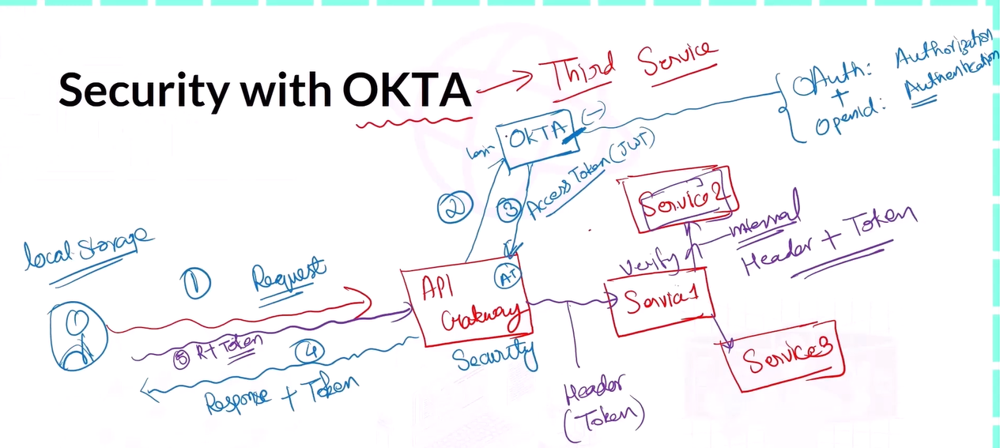

# DurgeshMicroservices


```

Spring Security

Implementing Spring Security in Microservices.

Secure with OKTA:

OKTA is providing N number of services for Security.

OAuth   -   used for Authorization
OpenID  -   used for Authentication

- If the request is coming first time then only we need to forward the request to the OKTA to generate Access Token (AT) or JWT Token.
- Now we send that JWN Token as a Response to the user.
- User will store this JWT Token. and Next time when the user send a request, request also contains the JWT Token.
- We only need to verify the JWT Token, Whether the user has valid JWT Token or not.

When you login with OKTA, Okta will generate Access Token (JWT Token).

JWT Token has
- Header
- Payload
- Signature

We can also define SCOPE, Using SCOPE we can implement that our user can not directly access any services.





Let's Implement Okta

- Create account on Okat, go to developer.okta.com
- Create Application [ OIDC - OpenID connect ] & Application Type - Web Application & give App Name
- in sign in & out redirect URL section   -   only change the port number to your API Gateway port number.
- in Assignment section     -   click on Skip group assignment for now
- Save
- Client ID & Client Secrets


Now Create Groups

- Normal
- Admin

Assign Group to the Application or vise versa

Application ->  Assignments ->  Assign apllication to group.


Client ID : 0oaiksqpb6JihXdcb5d7
Client Secrets : LoYlFp96EcKBAeYaJ0Afi9ykXlBvw4G9fpN-tQKPfCS2QIdM7zfOLc5dXjD-Cxlw


Implement Spring Security in API Gateway


Create an SCOPE Called 'INTERNAL', We define this scope for inter communication,
One service can call the other service only if it has 'internal' scope.


How to Create Scope

- Go to Security Section
- API
- Click on default  [Authorization Servers]
- Scopes
- Add Scope


We will use this SCOPE for inter communication of services.


Add Claim 

- Go to claim [beside scope]
- add claim
- value type - Groups
- Filter - Matches regex - .*   // regular expression
- Create


Now Configuration is DONE.


Now Start Coding 

Go to API Gateway Service & add Spring Security & Okta Dependency.


Now do the Configuration in application.yml file.


@EnableWebFluxSecurity  -   on Security Configuration Class.


Create a new Package com.gateway.config

Here we create SecurityConfig class & DO all the below Coding in that class itself.


```


```diff
This is the Microservices based Java SpringBoot project.
In this project we are developing the Restaurant Feedback Application.

User can give ratings and feedback to the number of Restaurants.

In this project we have created Three Services and One Eureka Server to register our services.
1. User Service
2. Restaurant Service
3. Rating Service
4. Api Gateway

We can update the Ratings and Restaurants Service using User Service API.

Dependency We Used for Eureka Service :

Eureka Server.

Dependency We Used for all three Services :

JPA
MySQL 
Spring Web
Eureka Client

DATABASE We Used :

MySQL Workbench

We have created durgeshuserservice SCHEMA for User Service.

We have created durgeshratingservice SCHEMA for Rating User Service.

We have created durgeshrestaurantservice SCHEMA for Restaurant Service.


```